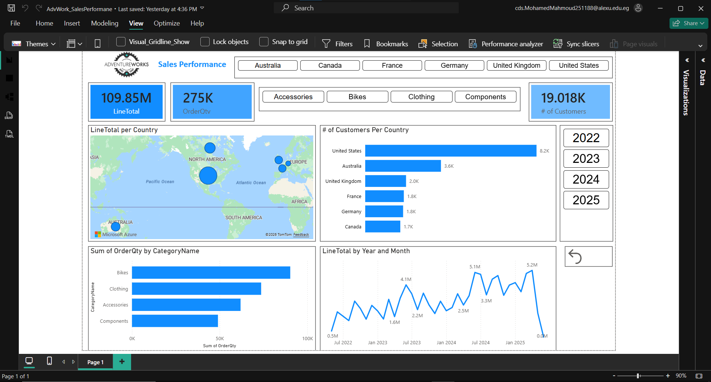

# AdventureWorks Sales Performance Dashboard

A comprehensive data analysis project focused on sales performance using the AdventureWorks dataset. This project covers the full data pipeline from SQL extraction to Power BI visualization.

## Project Workflow

### 1. Data Extraction (SQL)
- Created a dedicated database for the project.
- Developed a comprehensive SQL View to join multiple tables, including Sales, Products, Customers, and Territories, ensuring a structured and clean data source.

### 2. Data Transformation (Excel & Power Query)
- Connected the SQL View to Excel for processing.
- Utilized **Power Query** for the ETL process:
    - Cleaned and handled missing values.
    - Standardized data types for accurate calculations.
    - Optimized the dataset for the final visualization model.

### 3. Data Visualization (Power BI)
- Built an interactive dashboard to monitor key business metrics:
    - **Key Performance Indicators (KPIs):** Total Sales (LineTotal), Order Quantity, and Customer Count.
    - **Geographic Analysis:** Mapping sales distribution across North America, Europe, and Australia.
    - **Product Analysis:** Sales breakdown by category (Bikes, Clothing, Accessories, Components).
    - **Time Series Analysis:** Monthly and yearly sales trends.
    - **Interactive Filtering:** Slicers for Year, Country, and Category.

---

## Tools Used
- **SQL Server:** Data querying and View creation.
- **Excel & Power Query:** Data cleaning and transformation.
- **Power BI:** Data modeling and interactive visualization.
